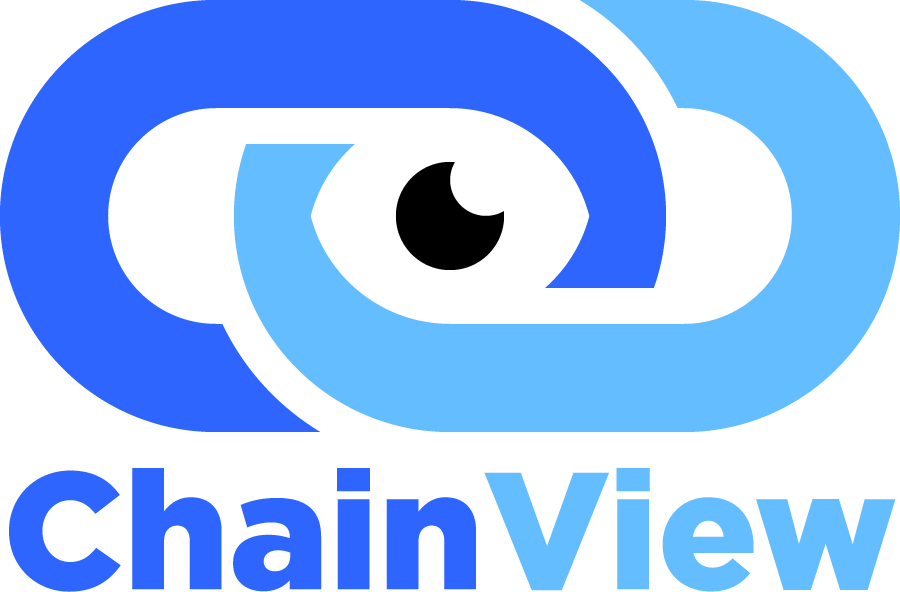
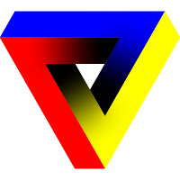

# Chainview



## Description

ChainView is a tool that allows us to retrieve dependent data in a simple ONE blockchain call, without deploying contract and paying any fees to anyone.
It's also an alternative of the Multicall, and can also simulate some transactions.
You just need to write your logic in Solidity to obtain your desired informations.
Enjoy anons !


## How to use

### 1-Create your logic

Create your Solidity(s) smart contract(s) on a `Chainview` folder at the root of the repo.

### 2-Compile your code

Your smart contract wants to be in a folder named `Chainview`, to be compiled using the command:

```
npx chainview compile
```

A new folder is created named `chainviewArtifacts` that contains the ABI and bytecode of your smart contract.

### 3-Call ChainView

Through a JavaScript/Typescript script, you can now call the ChainView function.

See examples in the `examples` folder.

### 4-And voilà !

## Usage

ChainView can be useful if you need to get multiple data onchain dependent from each others for a function that doesn't exist on a contract, or to be an alternative of a multicall (See examples below). The main interest for ChainView is that you can implement all the logic that you want to get some informations, your only limitation is the implementation of a Solidity contract itself, and all of that for FREE !
Also, using this method will clean and secure your code, because all the logic are managed by the Solidity contract, so you will have less side effect by implementing it on your projects.
The usage of ChainView instead of a multicall can be better/faster\* but keep in mind that more you add some logic more the time to get the data will increase.
Usually the public RPC's has a timeout (approximately 30s) for the onchain call so be careful with that anon.

### Example 1

You want to get from an ERC721Enumerable contract:

- the balance of an address => balanceOf(address)
- the tokenId of an address for a each index => tokenOfOwnerByIndex(address,index)
- result => tokenId owned by the address

If you want to get it from the classic way, you will need to call firstly balanceOf, waiting for the response and, secondly, use the response to call the tokenOfOwnerByIndex function.
With Chainview, you just need to implement a Solidity function that will fetch all these onchain data with a simple call.

### Example 2

You want to get from the UniswapV2 factory contract:

- the pairs from index 0 to 5 => factory.allPairs(index)
- for each pair you want the token0/token1 => pair.token0() / pair.token(1)
- for each tokens of the pair you want the symbol and the decimals => token.symbol() / token.decimals()
- result => a struct array with all the data returned

If you want to get it from the classic way, you will need to multicall firstly all the pairs from index 0 to 5, then waiting for the response and multicall token0 and token1 for each pairs, waiting again for the response, and finally get the symbol and the decimals data for each tokens of each pairs with a last multicall.
With Chainview, you just need to implement a Solidity function that will fetch all these onchain data with a simple call.

### Example 3

You want to simulate a transaction by sending ethers and returning some informations:

1. Send ETH to the ChainView contract with the ZeroAddress
2. Contract sends its balance to the DeadAddress
3. Return the contract's balance before the burn and after

If you want to do it from the classic way, it's not possible. You can only if you fork the mainnet and do some actions.
With ChainView, you are able to simulate any onchain action by sending ETH to your ChainView contract.

# Medium Article

https://medium.com/@r3vert/chainview-a-new-web3-tool-8184883d27c0

# Projects that use ChainView


https://cvg.finance/
